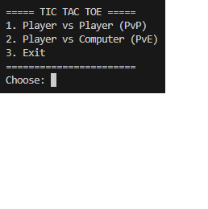

# Tic Tac Toe Game Engine (C)

A console-based Tic Tac Toe game implemented in C that demonstrates basic game logic, board state management, and algorithmic win-condition detection.

## Features
- Player vs Player mode
- Player vs Computer mode
- Board representation using a 2D array
- Win condition detection for rows, columns, and diagonals
- Input validation and turn-based game loop

## Concepts Practiced
- Arrays and memory structure
- Conditional logic and control flow
- Game loop design
- Basic algorithmic thinking

## Output

## Technologies
- C
